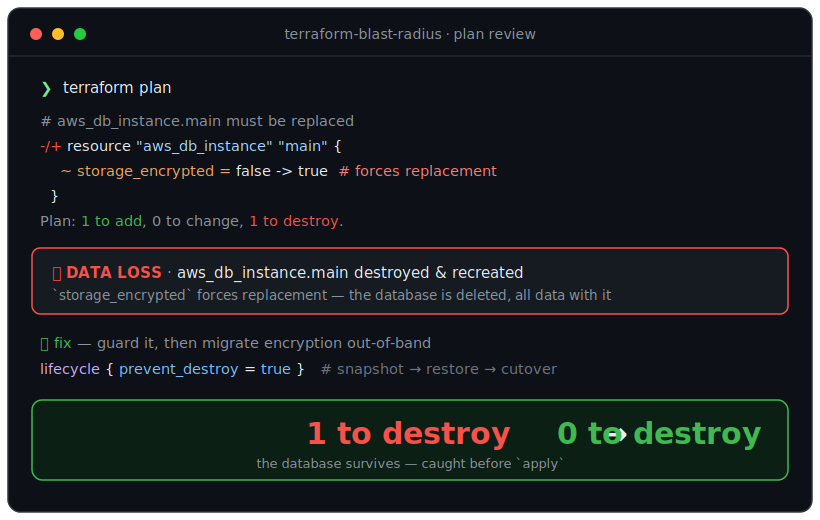

<div align="center">

# 💥 terraform-blast-radius

### That "small" Terraform change is about to destroy your database. This catches it before you apply.

**A [Claude](https://claude.com/claude-code) Agent Skill that reviews a `terraform plan` for destructive changes — the resources that will be destroyed and recreated — and rewrites them into a safe apply.**

[](#-install-in-30-seconds)
[](LICENSE)
[](CONTRIBUTING.md)
[](reference/)
[](reference/)

<br/>



<br/>

<sub><i>Terraform · OpenTofu · AWS · Google Cloud · Azure · any provider</i></sub>

</div>

---

## The 10-second version

You change one attribute on a database — flip `storage_encrypted`, tidy a `name`,
rename the resource. The diff looks tiny. You run `terraform apply`. The plan says
`Plan: 1 to add, 0 to change, 1 to destroy` — and that one destroy is your
production database, gone with all its data, because that attribute **forces
replacement**.

**`terraform-blast-radius` reads the plan, tells you exactly what will be destroyed
and why, and hands you the safe rewrite — before you apply.** It installs in 30
seconds and triggers automatically whenever you touch Terraform. No config, no
dependencies, no access to your cloud.

```diff
  # aws_db_instance.main must be replaced
- ~ storage_encrypted = false -> true   # forces replacement 🔴 destroys the DB — all data lost
+ lifecycle { prevent_destroy = true }   # ✅ turns the catastrophic apply into a safe error
+ # then migrate encryption out-of-band: snapshot → encrypted copy → restore → cutover
```

---

## The problem

Every one of these looks harmless. Every one can destroy a resource:

| You changed | What Terraform actually does |
|-------------|------------------------------|
| A database's `storage_encrypted`, `name`, or `engine` | `-/+` **replace** — destroys the DB and creates an empty one (**data loss**) |
| An EC2 instance's `user_data` (with replace-on-change) | Destroys then recreates the instance (**downtime**) |
| Removed one item from a `count` list | Every later index shifts → **mass** destroy-and-recreate |
| Renamed a resource (`web` → `app`) | Destroys `web`, creates `app` — unless you add a `moved` block |
| Ran `terraform state rm` | Orphans the real resource — now unmanaged |

The rules for *which* attribute forces replacement are real, specific, and
per-provider: RDS `storage_encrypted` replaces but `instance_class` resizes in
place; EC2 `user_data` replaces only with `user_data_replace_on_change`; a
security group's `description` forces replacement but its rules don't. Engineers
re-derive this every apply — or learn it the moment the plan says `destroy: 1`.

## The solution

`terraform-blast-radius` encodes that hard-won knowledge into Claude so the review
happens **automatically, consistently, every time** — and produces a fix, not just
a warning:

- 🔎 **Detects** every destroy and replace — a 12-item catalog covering
  forces-replacement attributes, renames, the `count` index-shift bomb, dangerous
  state ops, provider-upgrade churn, and shared-resource cascades.
- 🧠 **Explains** which attribute forces replacement, and whether it's **downtime
  (stateless) or data loss (stateful)**.
- 🔧 **Rewrites** it safely — `create_before_destroy`, `prevent_destroy`, a `moved`
  block, `for_each`, or an out-of-band snapshot→restore / blue-green migration.
- 🧭 **Maps the blast radius** — what depends on the resource you're about to change.
- 🎯 **Right-sizes** the advice — a throwaway dev instance can be recreated freely.

## The result

You apply infrastructure changes knowing exactly what will be destroyed *before*
you type `yes` — and the crown-jewel resources are guarded so a stray edit errors
instead of wiping data. No `Destroy: 1` surprises. No restore-from-backup at 3am.

---

## 🤔 Why not just ask Claude yourself?

The single most important question — and the reason a skill beats an ad-hoc prompt:

| | Plain prompt | **terraform-blast-radius skill** |
|---|:---:|:---:|
| Triggers automatically on every plan/diff | ❌ only when you remember | ✅ always |
| Carries the per-provider forces-replacement rules (RDS vs. EC2 vs. SG, GCP, Azure) | ⚠️ reconstructed from memory, easy to get wrong | ✅ curated & pinned |
| Classifies **downtime vs. data loss** for each destroy | ⚠️ sometimes | ✅ every time |
| Writes the fix — `moved` block, `for_each`, migration steps | ⚠️ sometimes | ✅ every time |
| Same review for your whole team | ❌ everyone prompts differently | ✅ commit it, everyone gets it |

A prompt is only as good as what you remember on a bad day. A skill is the reviewer
that never forgets which attribute forces replacement.

---

## 🚀 Install in 30 seconds

The skill is just a folder with a `SKILL.md`. Drop it where Claude looks for
skills — no build, no dependencies.

**For every project (your machine):**

```bash
git clone https://github.com/windchillscalanthes-ship-it/terraform-blast-radius.git \
  ~/.claude/skills/terraform-blast-radius
```

**For one project (commit it so your whole team gets it):**

```bash
git clone https://github.com/windchillscalanthes-ship-it/terraform-blast-radius.git \
  .claude/skills/terraform-blast-radius
```

> **Windows:** use `%USERPROFILE%\.claude\skills\terraform-blast-radius` or `.claude\skills\terraform-blast-radius`.

That's it. Claude discovers the skill from its description and loads it
automatically when you're working on Terraform. Confirm with `/skills` or just ask
*"what skills do you have?"*

---

## Usage

You don't invoke it by name — it triggers on intent. Just work on your
infrastructure and ask naturally:

> "Is this plan safe to apply?"
>
> "Will this destroy the database?"
>
> "Why is Terraform recreating this instead of updating it?"
>
> "How do I rename this resource without destroying it?"

Best used as a **pre-apply gate**: paste the `terraform plan` output (or the `.tf`
diff), get the destructive changes and the safe rewrite before you type `yes`.

### Realistic scenarios

<details>
<summary><b>① The encryption toggle that deletes the database</b></summary>

> **You:** I set `storage_encrypted = true` on our RDS instance. Safe?
>
> **Skill:** 🔴 **DATA LOSS.** `storage_encrypted` **forces replacement** on
> `aws_db_instance` — Terraform will destroy the database and create a new *empty*
> one. You can't enable encryption in place. Do it out of band: snapshot → copy the
> snapshot with encryption → restore to a new instance → cut over. And add
> `lifecycle { prevent_destroy = true }` now so an accidental apply errors instead
> of wiping data.

</details>

<details>
<summary><b>② The one-line list edit that recreates the fleet</b></summary>

> **You:** I removed one tenant from the `count` list. Just deletes that one, right?
>
> **Skill:** 🔴 No — `count` tracks resources by **index**. Removing a middle
> element shifts every later index, so Terraform destroys and recreates all of
> them. Switch to `for_each` with stable keys:
> ```hcl
> for_each = toset(var.tenants)   # web["alpha"], not web[0]
> ```
> Then removing "beta" is `1 to destroy`, not a rolling outage. Use `moved` blocks
> to migrate the existing indices to keys without churn.

</details>

<details>
<summary><b>③ The rename that isn't free</b></summary>

> **You:** Renaming `aws_instance.web` to `aws_instance.app`.
>
> **Skill:** 🟡 Terraform reads that as "destroy `web`, create `app`" — a
> destroy+recreate. Add a `moved` block so it's a pure state move:
> ```hcl
> moved {
>   from = aws_instance.web
>   to   = aws_instance.app
> }
> ```
> Plan becomes `0 to add, 0 to change, 0 to destroy`.

</details>

See [`examples/`](examples/) for five fully worked unsafe/safe pairs.

---

## What it catches

<div align="center">

| Change | Risk | Safe approach |
|--------|------|---------------|
| Forces-replacement attr on a **stateful** resource | Data loss | Avoid attr / out-of-band migration + `prevent_destroy` |
| Forces-replacement attr on a **stateless** resource | Downtime | `create_before_destroy` |
| Remove a resource from config | Destroys it | `removed` block / intended? |
| Rename a resource address | Destroy + recreate | `moved` block |
| `count` list, remove middle element | Mass recreation | `for_each` with stable keys |
| `terraform state rm` | Orphaned resource | `moved` / `removed` block |
| `apply -replace` / `taint` | Forced destroy+recreate | Only on stateless; snapshot first |
| `-target` subset apply | Partial apply, drift | Apply the full reviewed plan |
| Provider/module upgrade | Spurious replacements | Pin versions; scrutinize the plan |
| Change a shared resource (VPC/SG/IAM) | Wide cascade | Map dependents; migrate onto a new one |
| No `prevent_destroy` on data stores | One edit wipes data | Guard the crown jewels |
| Apply without reviewing the plan | Unreviewed destroy | `plan -out` → review → `apply` |

</div>

Provider-specific forces-replacement tables live in [`reference/`](reference/).

## Supported stacks

- **Tools:** Terraform · OpenTofu (identical semantics)
- **Providers (deep references):** AWS · Google Cloud · Azure
- **Also reasons about:** any provider — the plan verbs, `# forces replacement`,
  lifecycle rules, and `moved`/`removed` blocks are universal

## How it works

`terraform-blast-radius` uses **progressive disclosure** — the core idea behind
Agent Skills:

- `SKILL.md` carries the trigger, the review workflow, and the high-frequency risk
  catalog (small, cheap to load, provider-agnostic).
- [`reference/`](reference/) holds the deep, provider-specific detail — pulled in
  **only when relevant** to the change in front of you.

```
terraform-blast-radius/
├── SKILL.md          # workflow + risk catalog + output format
├── reference/        # loaded on demand: aws, gcp-azure, lifecycle, patterns
└── examples/         # worked unsafe/safe pairs
```

## How it compares to policy-as-code

Tools like [OPA/Conftest](https://www.openpolicyagent.org/),
[Sentinel](https://developer.hashicorp.com/terraform/cloud-docs/policy-enforcement),
[tfsec](https://github.com/aquasecurity/tfsec)/[Trivy](https://github.com/aquasecurity/trivy),
and [driftctl](https://github.com/snyk/driftctl) are excellent and prove the
demand — but they *enforce* rules in CI on a plan you've already written, and
rarely explain the mechanism or write the fix. `terraform-blast-radius` is
**complementary**: it reasons across providers while you author and review,
explains *which attribute forces replacement and why*, and **writes the corrected
HCL or the migration steps**. Enforce policy in CI *and* use this skill as you work.

## Roadmap

See [ROADMAP.md](ROADMAP.md). Highlights: Kubernetes/Helm and more providers, a CI
recipe that reviews `terraform show -json` output as a PR comment, a companion
GitHub Action, and more worked examples. Ideas and PRs welcome.

## Contributing

Providers are deep and their replacement rules are specific — **corrections and new
rules are the most valuable contribution you can make.** A single accurate rule
about which attribute forces replacement can save someone a destroyed database.
Start with [CONTRIBUTING.md](CONTRIBUTING.md) and the [issue templates](.github/ISSUE_TEMPLATE).

## Disclaimer

Treat the output as an expert-informed **review, not a guarantee**. Replacement
behavior depends on your exact provider version and resource configuration. Always
read the real `terraform plan` yourself, keep `prevent_destroy` on your data
stores, and have a tested backup before applying anything destructive.

## License

[MIT](LICENSE) © 2026 [windchillscalanthes-ship-it](https://github.com/windchillscalanthes-ship-it)

<div align="center">
<br/>
<strong>If this caught a destroy before you applied it, a ⭐ helps other engineers find it before their next 3am restore.</strong>

<sub>Part of the <b>Ship-Safe</b> family of pre-merge review skills · see also <a href="https://github.com/windchillscalanthes-ship-it/safe-migrations">safe-migrations</a> · <a href="https://github.com/windchillscalanthes-ship-it/n-plus-one-hunter">n-plus-one-hunter</a></sub>
</div>
